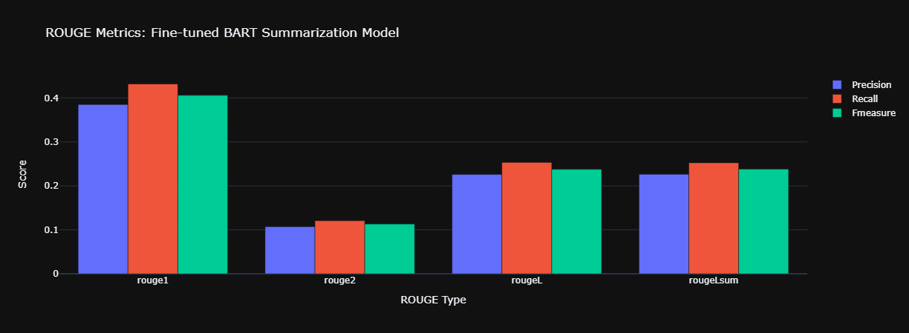

# Abstractive Summarization of Amazon Product Reviews using LLMs

## Table of Contents

- [Problem Statement](#Problem-Statement)
- [Data](#Data)
- [Model Selection](#Model-Selection)
- [Adapting the model](#Adapting-the-model)
- [Evaluation](#Evaluation)
  - [Human Evaluation](#Human-evaluation)
  - [ROUGE Metrics](#ROUGE-metrics)
- [Challenges & Considerations](#Chalenges-&-Considerations)

  
## Problem Statement

* The goal of this project is to explore the capabilities of Large Language Models (LLMs) in extracting concise summaries from Amazon Product Reviews. 
* Abstractive summarization technique, which involves generating new sentences as summaries by understanding the context of the texts, was used in this summarization projects.

## Data

The data is a collection of product reviews summaries automatically generated by PASS for 32 Amazon products from the FewSum Dataset. You can download the data [here](https://github.com/abrazinskas/FewSum/tree/master/artifacts/amazon/gold_summs/). Each product in the dataset has 8 reviews and 3 summaries taken by humans.

## Model Selection

Leveraged the ['facebook/bart-large-cnn'](https://huggingface.co/facebook/bart-large-cnn) model which has been pre-trained on CNN Daily Mail data, making it a good model for summarization tasks.

## Adapting the model

* Prompt engineering through **Zero-shot inferencing** to assess whether the model is good at grasping the summarization task and returning a good summary, without fine-tuning
* Fine-tuning involved updating the weights of the pre-trained Bart model on the smaller Amazon Product Reviews dataset to improve model performance.
 
## Evaluation

### Human Evaluation
This involved comparing the human baseline summaries to the model generated summaries as seen below.

Human Baseline Summary: 

>This Thomas the train costume is perfect for small children. It fits most children up to five or six years old, and could even be used multiple times as the child grows. It has a handy pouch on the front that holds a large load of candy. The costume is highly recommended.

Model Summary:

>This Thomas the train costume is a great fit for a young child. The costume is well made and the candy pouch is large enough to fit in any size child. This is a cute costume that will grow with the child and fit well into the next two years. It is not the perfect fit for older children, but it is a good fit for this age group

### ROUGE Metrics

## Challenges & Considerations

* Long Training Time - Training time, took approximately 20 minutes on my local machine. This could be resolved with GPU acceleration.
* Limited Dataset - Working with a modest dataset of 40 observations posed limitations, emphasising the need for a more extensive dataset for future endeavours. Can you imagine the training time if the dataset was double its size?
* Memory Intensity of LLMs -The BART model proved to be memory-intensive during runtime. Considerations for less computationally expensive techniques, such as Parameter Efficient Fine Tuning (PEFT), are on the horizon.
